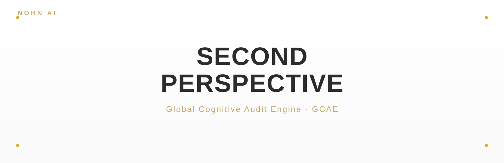
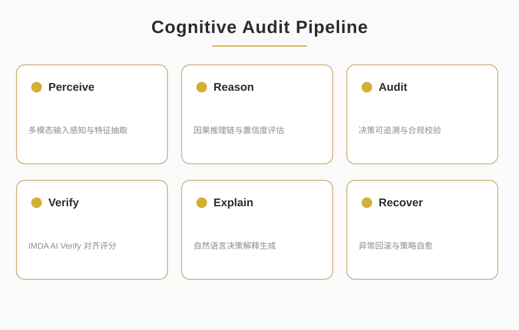

<p align="center">
  
</p>

<p align="center">
      
</p>

<blockquote align="center">
  <em>Global Cognitive Audit Engine · GCAE</em>
</blockquote>

<div style="max-width:880px;margin:0 auto;padding:0 16px">

## ✦ About

<p style="font-size:15px;line-height:1.8;color:#2C2C2C">SECOND-PERSPECTIVE 是全球认知审计引擎（GCAE），以第二人称视角对 AI 决策进行可追溯、可验证的认知审计。它在 IMDA AI Verify 评测中取得 95 分，提供从感知、推理到行动的全链路审计管线，让智能系统的每一步判断都可被解释与复核。</p>

<p align="center">
  
</p>

</div>

<p align="center">— ✦ —</p>

## ✦ Quick Start

```bash
git clone git@github.com:NOHN-AI/SECOND-PERSPECTIVE.git
cd SECOND-PERSPECTIVE
pip install -r requirements.txt
python demo.py
```

<p align="center">— ✦ —</p>

<p align="center">
  <a href="https://github.com/NOHN-AI">NOHN-AI</a>
  &nbsp;·&nbsp;
  <a href="https://www.nohnlins.com/">nohnlins.com</a>
  &nbsp;·&nbsp;
  <a href="mailto:ai@nohnlins.com">ai@nohnlins.com</a>
</p>
<p align="center"><sub>NOHN AI · SECOND-PERSPECTIVE</sub></p>
