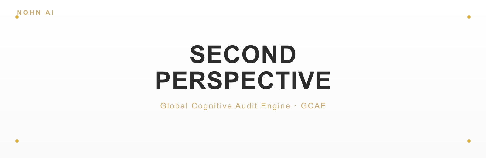
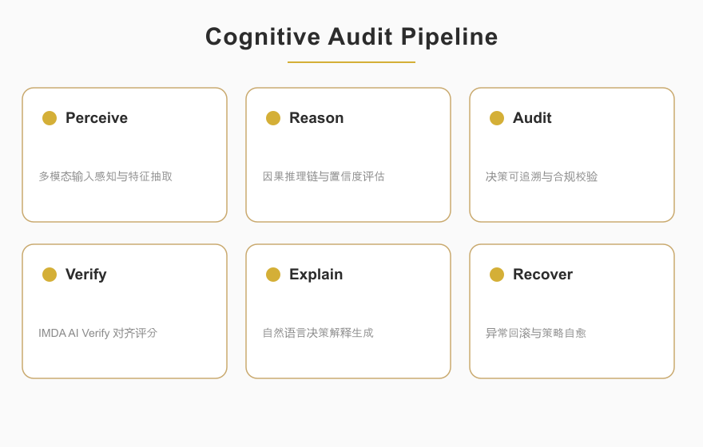

<p align="center">
  
</p>

<p align="center">
  
  
  
</p>

<blockquote align="center">
  <em>NOMOS · v0.3.0 — The Intelligent Decision Hub</em>
</blockquote>

<div style="max-width:880px;margin:0 auto;padding:0 16px">

## ✦ About

<p style="font-size:15px;line-height:1.8;color:#2C2C2C">
NOMOS is an intelligent decision hub with a built-in auditable deterministic core. It scored <strong>95/100</strong> in Singapore's <strong>IMDA AI Verify</strong> compliance assessment. The engine unifies structured evaluation, fine-grained algorithmic auditing, causal counterfactual re-selection, declared-scenario stress testing, structured cognitive challenge, information prioritization, and human governance into a single report.
</p>

<p style="font-size:15px;line-height:1.8;color:#2C2C2C">
It never invents missing facts, weights, thresholds, responsible parties, evidence, or probabilities. It produces candidates under declared inputs and always keeps the final verdict outside the algorithm.
</p>

<p align="center">
  
</p>

</div>

<p align="center">— ✦ —</p>

## ✦ Built-in Universal Audit Engine

<div style="max-width:880px;margin:0 auto;padding:0 16px">

<p style="font-size:15px;line-height:1.8;color:#2C2C2C">
NOMOS ships a <strong>universal audit engine</strong> — not a bolt-on patch. The audit trail is built into the deterministic core: every decision, assumption, constraint, and causal step is recorded, hash-linked, and independently verifiable by design.
</p>

<p style="font-size:15px;line-height:1.8;color:#2C2C2C">
It scored <strong>95/100</strong> in the causal-audit track of Singapore's <strong>IMDA AI Verify</strong>. The full compliance report is included as <code>IMDA_AI_Verify_Causal_Audit_Report.pdf</code>.
</p>

</div>

<p align="center">— ✦ —</p>

## ✦ What's New in v0.3

- Hash-chained audit events for every major deterministic operation
- Explicit operands and outputs for constraint and criterion calculations
- True candidate re-selection after transmitted assumption failures
- Stress scenarios declared by the user (failed assumptions, metric overrides)
- Deterministic cognitive-risk challenge layer that infers no mental states
- Prioritized information acquisition and review queue
- An `IntelligentDecisionHub` orchestrator and a sealed `HubReport`
- Full audit ledger inside both baseline and scenario runs
- New `POST /v1/hub/analyze`, while retaining every v0.2 endpoint
- v0.3 package, CLI demos, generated OpenAPI, and CI coverage gate

Architecture and boundaries: [`docs/INTELLIGENT_DECISION_HUB_V0_3.md`](docs/INTELLIGENT_DECISION_HUB_V0_3.md).
Base v0.2 design: [`docs/DECISION_FOUNDATION_V0_2.md`](docs/DECISION_FOUNDATION_V0_2.md).

## ✦ Three-Layer Causal Reconstruction (Bounded Convergence + Human Gate)

New in `hub/session.py` (`ReconstructionSessionEngine`) and `decision/reconstruction.py` (`reconstruct_with_delta`): the previously one-shot causal reconstruction is upgraded into a **bounded, hash-chained, human-gated iterative process**.

Each round runs the three causal operators:

1. **Forward invalidation propagation** — `invalidation_closure` propagates a declared assumption failure forward, dropping alternatives that lose that assumption's support.
2. **Backward root-cause tracing** — the existing reverse BFS traces deviation signals back to a candidate set of root-cause hypotheses.
3. **Delta reconstruction** — declared correction variables (`DeltaVar`) are applied to a copy of the request, the deterministic evaluator is re-run, and convergence of the leading candidate set is judged.

Design invariants (aligned with the NOMOS core):

- **No guessing** — every hypothesis is a candidate; a human decides. The engine never auto-loops.
- **Deterministic** — each round derives exclusively from declared inputs.
- **Auditable** — every round is hash-linked to the previous one; the whole session forms a `session_root_hash`.
- **Bounded** — capped by `max_iterations` and `max_evidence_requests`.
- **Human gate** — `advance()` performs exactly one round and then stops at `AWAITING_HUMAN`; only a human decision (`approve` / supply evidence / reject) may move to the next round.

Stop conditions: fixed point (candidate set stops changing), no gain (no unresolved branches and all assumptions settled), or budget exhausted.

```python
from second_perspective.models import DecisionRequest, DeviationSignal, DeltaVar
from second_perspective.hub.session import ReconstructionSessionEngine

engine = ReconstructionSessionEngine()
session = engine.start(request, signals, max_iterations=5)
session = engine.advance(session)                                   # round 1: three-layer reconstruction
session = engine.advance(session, [                                 # inject a declared correction
    DeltaVar(path="A2", value=None, reason="...", responsibility="..."),
])
session = engine.human_decision(session, approved=True)             # human seal
print(session.session_root_hash)
```

A `DeltaVar` path may take three forms: `"A2"` (falsify an assumption, propagated through the dependency graph), `"criteria.K1.weight"` (rewrite a criterion weight), or `"alternatives.S1.metrics.cost"` (rewrite an alternative metric). The engine mirrors each declared `DeltaVar` verbatim and never invents corrections.

## ✦ Architecture

```text
HubAnalysisRequest
  -> Decision Core
       -> Structure / Evidence Audit
       -> Hard + Soft Constraint Evaluation
       -> Normalized Scoring
       -> Causal Invalidation
       -> Counterfactual Re-selection
       -> Pareto + Weight Sensitivity
       -> Hash-Chained Algorithm Audit
  -> Declared-Scenario Stress Runs
  -> Structured Cognitive Risk Challenge
  -> Information Prioritization Queue
  -> Append-only DecisionRecord
  -> Sealed HubReport
  -> Human Approve / Reject
```

## ✦ Install & Test

```bash
python -m venv .venv
source .venv/bin/activate        # Windows: .venv\Scripts\activate
pip install -e ".[dev]"
pytest
```

## ✦ Run the Demos

Core decision core:

```bash
nomos-demo
```

NOMOS (Intelligent Decision Hub) with two stress scenarios:

```bash
nomos-hub-demo
```

## ✦ Python Usage

```python
from second_perspective import IntelligentDecisionHub
from second_perspective.models import HubAnalysisRequest

request = HubAnalysisRequest.model_validate(
    {
        "decision": decision_payload,
        "scenarios": [
            {"id": "SC1", "name": "Critical assumption failure", "failed_assumption_ids": ["A1"]},
            {"id": "SC2", "name": "Cost shock", "metric_overrides": {"S2": {"capital_required": 6000000}}},
        ],
    }
)
report = IntelligentDecisionHub().analyze(request)
```

The returned report contains the baseline decision record, scenario results, cognitive findings, information priorities, algorithm-ledger verification status, policy snapshot, and report hash.

## ✦ Run the API

Local development runs keyless:

```bash
export SP_ENV=development
uvicorn second_perspective.api.main:app --reload
```

Production refuses to boot without a key:

```bash
export SP_ENV=production
export SP_API_KEY="replace-with-a-strong-secret"
uvicorn second_perspective.api.main:app --host 0.0.0.0 --port 8000
```

Protected clients send `Authorization: Bearer <SP_API_KEY>`.

Endpoints:

- `GET /health`
- `GET /v1/auth/me`
- `POST /v1/hub/analyze`
- `GET /v1/hub/reports/{hub_run_id}`
- `POST /v1/decisions/evaluate`
- `GET /v1/decisions/{decision_id}`
- `GET /v1/decisions/{decision_id}/history`
- `POST /v1/decisions/{decision_id}/approval`

Optional PostgreSQL persistence: set `SP_DATABASE_DSN` (`asyncpg`); OIDC-aware identity: set `SP_OIDC_ISSUER`.

## ✦ Regenerate the OpenAPI Schema

```bash
SP_PUBLIC_BASE_URL=https://decision.example.com \
python scripts/export_openapi.py
```

## ✦ Compatibility

All v0.2 decision requests and endpoints remain valid. Responses add `counterfactuals`, `algorithm_audit`, `algorithm_audit_root_hash`. Clients that strictly deserialize response fields must update their models.

## ✦ Production Boundaries

v0.3 is a feature-complete NOMOS application core, not yet a full multi-tenant enterprise control plane. The default store remains in-process memory. Production needs a persistent event store, OIDC and authorization enforcement, tenant isolation, KMS signing, rate limiting, observability, backups, migrations, and domain control packs.

The cognitive scanner only challenges structural risk. It does not diagnose people, read motives, or replace legal, medical, financial, or security professionals.

## ✦ Project Structure

```
nomos/
├── pyproject.toml              # package: nomos-decision-engine v0.3.0
├── src/second_perspective/
│   ├── cli.py / hub_cli.py     # demo entry points (nomos-demo / nomos-hub-demo)
│   ├── service.py / repository.py / canonical.py / version.py
│   ├── api/                    # FastAPI: main.py, security.py
│   ├── audit/                  # auditor, execution, graph, ledger
│   ├── decision/               # causal, counterfactual, engine, evaluator,
│   │                           #   integrity, policy, robustness, selection,
│   │                           #   reconstruction (three-layer)
│   ├── governance/             # approval
│   ├── hub/                    # orchestrator, cognitive, information, integrity,
│   │                           #   policy, repository, scenario, session (gate)
│   ├── models/                 # enums, hub, schemas
│   └── persistence/            # asyncpg PostgreSQL repository (SP_DATABASE_DSN)
├── docs/                       # DECISION_FOUNDATION_V0_2.md, INTELLIGENT_DECISION_HUB_V0_3.md
├── examples/market_entry.json  # sample decision request
├── scripts/export_openapi.py
├── tests/                      # test_api / test_engine / test_foundation / test_hub / test_session
├── Dockerfile · docker-compose.yml · openapi-action.yaml
├── requirements-engine.txt · requirements-engine-dev.txt
├── IMDA_AI_Verify_Causal_Audit_Report.pdf
└── assets/                     # banner.svg/png, overview.svg/png
```

<p align="center">— ✦ —</p>

## ✦ Ecosystem

NOMOS is a member of the NOHN AI ecosystem — a family of projects built around second-perspective causal auditing and deterministic execution:

| Project | Repository | Role |
|---|---|---|
| **Second-Perspective (GCAE)** | [nohn3043-arch/second-perspective](https://github.com/nohn3043-arch/second-perspective) | Global cognitive audit engine — five-operator causal audit kernel (IMDA 95/100) |
| **NOMOS** | [nohn3043-arch/second-perspective](https://github.com/nohn3043-arch/second-perspective) (`Intelligent-Decision-Hub--Nomos` branch) | Auditable deterministic decision hub (IMDA 95/100) |
| **SPL-G1** | [nohn3043-arch/SPL-G1](https://github.com/nohn3043-arch/SPL-G1) | Hardware causal-audit trusted compute unit (TCU) |
| **SPL-Virtual-World-Base** | [nohn3043-arch/Second-Reality](https://github.com/nohn3043-arch/Second-Reality) | Virtual-world and metaverse infrastructure (constitution / law / bridge) |
| **Story-Engine** | [nohn3043-arch/story-engine](https://github.com/nohn3043-arch/story-engine) | Long-form narrative consistency engine |
| **Antares** | [nohn3043-arch/Antares](https://github.com/nohn3043-arch/Antares) | GFSIP v1.0 — causally-audited federated stable-interop protocol |
| **Anthropomorphic-Agent-Engine** | [nohn3043-arch/Anthropomorphic-Agent-Engine](https://github.com/nohn3043-arch/Anthropomorphic-Agent-Engine) | Deterministic anthropomorphic psychology engine (SPL Pure Core V8.0) |
| **PAGES** | [nohn3043-arch/pages](https://github.com/nohn3043-arch/pages) | Official NOHN AI ecosystem landing page |

<p align="center">— ✦ —</p>

## ✦ License & Authorization

This repository is **not open source**. Dual-track: free for personal non-commercial research; government / enterprise requires a paid commercial license. See [LICENSE](./LICENSE) — the licensor and applicable law depend on the user's location (within China → Shanghai Linming Junhua Technology Co., Ltd., PRC law; outside → NOHN AI TECHNOLOGY PTE. LTD., Singapore law + SIAC arbitration).

- **Request a license**: International / Global — [ai@nohnlins.com](mailto:ai@nohnlins.com) · China — [lin@secondai.top](mailto:lin@secondai.top)

Compliance documents:

- [Shanghai compliance note](./docs/COMPLIANCE_SHANGHAI.md)
- [Privacy policy (CN)](./docs/PRIVACY_POLICY_CN.md)
- [Data processing agreement (CN)](./docs/DATA_PROCESSING_AGREEMENT_CN.md)

<p align="center">
  <a href="https://github.com/nohn3043-arch">GitHub</a> · <a href="https://www.nohnlins.com">Website</a> · <a href="mailto:ai@nohnlins.com">ai@nohnlins.com</a>
</p>
<p align="center"><sub>NOHN AI · NOMOS</sub></p>
